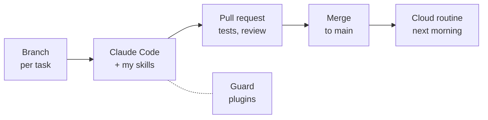
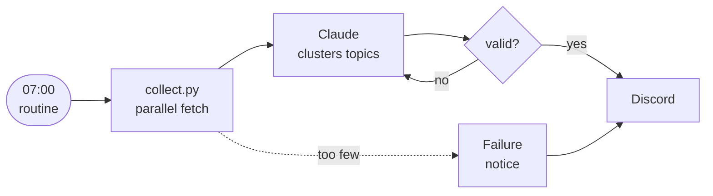

## Hi, I'm Dawn 👋

Backend software engineer in Vancouver, BC. I like systems that stay correct under load.

```java
public class Dawn {

    String role       = "Backend Software Engineer";
    String location   = "Vancouver, BC";
    String experience = "7+ years on high-traffic e-commerce and gaming platforms";

    List<String> focus = List.of(
            "distributed systems", "data consistency", "event-driven design");

    List<String> stack = List.of(
            "Java", "Spring Boot", "Kafka", "MySQL", "Redis",
            "TypeScript", "Angular", "Vue.js");

    // most of my professional code lives in private repositories
    List<String> sideProjects = List.of(
            "dawndeck", "Bloomlog", "dawnbase", "ai-trend-digest", "leetcode");

    String openTo = "Backend and full-stack Software Engineer roles in Canada";
}
```

<p>
  
</p>

### How I use AI and GitHub



- **Claude Code, customized** · 13 skills I built for study, research and note-keeping, plus three plugins with tests: one blocks commits and pushes to `main` and risky deletes, one masks secrets on screen, one shows the current branch above the prompt.
- **A pull request per change, even solo** · 170+ merged across my own repositories since March 2026.
- **AI on a schedule** · two Claude cloud routines check out a repository and run every morning: an AI news digest and a daily planning message.
- **Setup in git** · my Claude Code setup lives in a repository, and a bootstrap script restores it on a new machine.

### Side projects

- **dawndeck** · spaced-repetition learning platform · TypeScript, Next.js, PostgreSQL
- **Bloomlog** · skincare tracking app for Android · React, TypeScript, Supabase
- **[dawnbase](https://github.com/bnivibe/dawnbase)** · personal knowledge archive · Next.js, Supabase
- **[ai-trend-digest](https://github.com/bnivibe/ai-trend-digest)** · daily AI developer digest: collects posts from YouTube, Hacker News and Reddit, clusters them with Claude, and posts to Discord every morning · Python
- **[leetcode](https://github.com/bnivibe/leetcode)** · daily coding practice: LeetCode Top Interview 150, solved by hand in Java, then rewritten in Kotlin, with notes on what I missed and what to practice next

ai-trend-digest, every morning:



### Reach me

[LinkedIn](https://www.linkedin.com/in/bnivibe) · [bnivibe333@gmail.com](mailto:bnivibe333@gmail.com)
